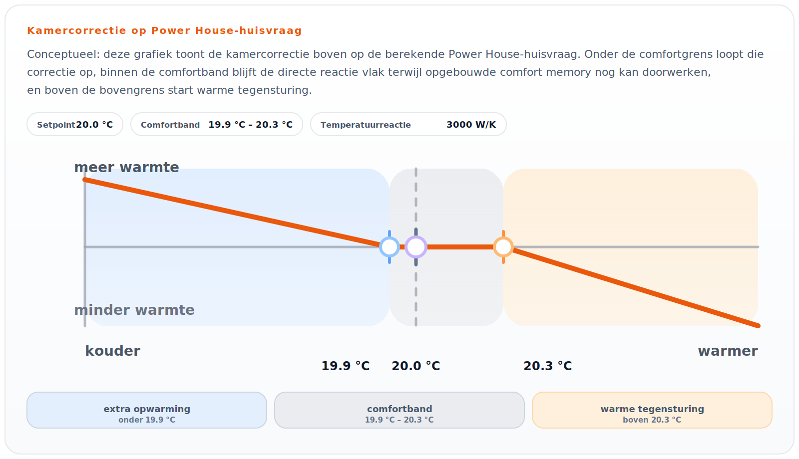

# Verwarmen en koelen uitgelegd

Deze pagina legt OpenQuatt uit in gewone taal. Het doel is niet dat je alle interne logica kent, maar dat je snapt hoe het systeem denkt en welke keuzes voor jou het belangrijkst zijn.

## In een zin

OpenQuatt zit tussen je thermostaat, je warmtepomp en Home Assistant:

- de thermostaat vraagt warmte of koeling;
- de warmtepomp maakt die warmte of koeling;
- OpenQuatt beslist hoe actief of terughoudend het systeem mag reageren;
- Home Assistant laat zien wat er gebeurt en waar je iets kunt aanpassen.

## Wat doet OpenQuatt precies?

OpenQuatt vervangt je thermostaat niet. Het is de laag die meetwaarden verzamelt, controleert welke bron bruikbaar is en de warmtepomp rustiger en slimmer laat reageren.

Praktisch betekent dat:

- OpenQuatt kijkt welke temperatuur- en flowwaarden het echt vertrouwt;
- het voorkomt dat het systeem te agressief reageert op kleine schommelingen;
- het houdt rekening met grenzen en beveiligingen;
- het maakt gedrag zichtbaar in Home Assistant.

## Verwarmen: twee manieren van denken

OpenQuatt kent twee hoofdstrategieën voor verwarmen. Voor de meeste gebruikers is dit de belangrijkste keuze.

### 1. `Power House`

`Power House` denkt vooral vanuit het huis en het comfort.

In gewone taal:

- hoe koud is het buiten;
- hoe ver zit de kamer van het gewenste punt af;
- hoeveel warmte heeft het huis dan ongeveer nodig;
- hoe snel mag die warmtevraag oplopen of afnemen.

Deze strategie past vaak goed als je:

- vooral naar kamertemperatuur en comfort kijkt;
- wilt dat OpenQuatt meer zelf beslist;
- rustige, langere verwarmingsruns prettig vindt;
- bij `Duo` wilt dat OpenQuatt zelf de zuinigste geldige combinatie kiest.

Eenvoudig onthouden:

- `Power House` denkt eerst aan het huis, en pas daarna aan de warmtepomp.

Dit schema uit de webapp laat zien hoe de kamercorrectie in Power House rond het setpoint werkt:

Onder de comfortband vraagt Power House extra warmte. Binnen de comfortband blijft de directe reactie vlakker. Boven de bovengrens start warme tegensturing.

### 2. Stooklijnregeling (`Water Temperature Control`)

Deze strategie denkt vooral vanuit de gewenste watertemperatuur.

In gewone taal:

- hoe koud is het buiten;
- welke aanvoertemperatuur hoort daar ongeveer bij;
- zit de echte aanvoer daaronder of daarboven;
- hoeveel extra warmtepompvraag is nodig om die aanvoer te volgen.

Deze strategie past vaak goed als je:

- gewend bent te werken met een stooklijn;
- de aanvoertemperatuur centraal wilt zetten;
- liever in watergedrag denkt dan in een huismodel;
- zelf duidelijk wilt bepalen welke aanvoertemperatuur bij welk weer past.

Eenvoudig onthouden:

- stooklijnregeling denkt eerst aan het water, en pas daarna aan het huis.

## Welke strategie moet ik kiezen?

Er is geen universeel beste keuze. Kies vooral de strategie die het best past bij hoe jij je systeem bekijkt.

Kies eerder `Power House` als:

- je comfort en kamertemperatuur het belangrijkst vindt;
- je zo min mogelijk in stooklijninstellingen wilt denken;
- je wilt dat OpenQuatt bij `Duo` veel zelf optimaliseert.

Kies eerder stooklijnregeling als:

- je gewend bent aan weersafhankelijke regeling;
- je graag met aanvoertemperaturen werkt;
- je liever een klassieke verwarmingsaanpak volgt.

Twijfel je? Begin dan met de strategie die het meest logisch voelt, en wissel niet te snel heen en weer. Eerst kijken hoe het systeem zich over langere tijd gedraagt is meestal verstandiger dan direct finetunen.

## Wat betekent koeling binnen OpenQuatt?

Koeling is niet simpelweg "verwarmen maar dan andersom". Bij koeling is vooral het risico op condens belangrijk.

Daarom werkt OpenQuatt bij koeling terughoudend:

- er moet echt een koelvraag zijn;
- de flow moet bruikbaar zijn;
- de minimale veilige watertemperatuur moet bewaakt worden;
- dauwpuntinformatie is normaal gesproken nodig.

Koelvraag heeft een kleine hysterese rond het kamer-setpoint. Standaard start koelvraag pas wanneer de kamertemperatuur meer dan `0,4°C` boven het setpoint zit. De koelvraag stopt weer zodra de kamer onder `setpoint + 0,1°C` komt. Dit voorkomt dat koeling steeds kort aan en uit schakelt rond het setpoint.

Deze marges zijn runtime-instellingen:

- `Cooling Request On Delta`
- `Cooling Request Off Delta`

Als er koelvraag is, stuurt OpenQuatt niet rechtstreeks op de kamertemperatuur. De kamerlaag bepaalt alleen of koeling nodig is. Daarna kijkt de waterregeling naar de aanvoertemperatuur.

Daarbij gebruikt OpenQuatt twee afstanden:

- `buffer gap`: hoeveel de aanvoer nog boven het koeldoel zit;
- `dew gap`: hoeveel de aanvoer nog boven het echte dauwpunt zit.

Het koeldoel is de hoogste waarde van:

- `Cooling Minimum Supply Temp`;
- de dauwpuntveilige of fallback-ondergrens.

Zolang het water nog duidelijk warmer is dan dit doel, mag de regelaar meer koelvraag opbouwen tot `Cooling Demand Max`. Dicht bij het doel bouwt OpenQuatt terug. Als de ruimte nog koelvraag heeft en de veiligheidsruimte voldoende stabiel is, mag level 1 blijven draaien als rustige onderhoudsstand. Dat voorkomt dat de compressor telkens uitgaat zodra het water precies het target raakt.

Een hogere `Cooling Demand Max` betekent niet dat OpenQuatt meteen hard gaat koelen. Een nieuwe koelrun start rustig op level 1. Pas als level 1 de aanvoer onvoldoende richting target trekt, mag de regelaar tijdelijk opschalen. Zodra de aanvoer duidelijk daalt, houdt OpenQuatt weer level 1 vast om doorschieten onder het target te voorkomen.

Als level 1 nog steeds te veel koelt, of als de aanvoer te snel richting de veilige ondergrens zakt, stopt OpenQuatt alsnog. Na zo'n waterzijde-stop gebruikt `Cooling Restart Delta` hoeveel de aanvoer eerst weer boven het doel moet opwarmen voordat de watercyclus opnieuw mag starten.

### Waarom is dauwpunt zo belangrijk?

Bij vloerkoeling of andere watergedragen koeling wil je voorkomen dat oppervlakken te koud worden en vocht uit de lucht erop condenseert.

Daarom kijkt OpenQuatt bij koeling niet alleen naar comfort, maar ook naar veiligheid:

- is de lucht in huis vochtig;
- wat is dan de veilige ondergrens voor de watertemperatuur;
- mag cooling op dit moment dus wel of niet vrijgegeven worden.

### Wat doet `Manual Cooling Enable`?

Die schakelaar geeft extra handmatige toestemming, maar vervangt geen normale koelvraag en geen beveiliging.

Kort gezegd:

- handmatig toestaan is niet hetzelfde als onbeperkt mogen koelen.

## `Single` en `Duo`

Bij `Single` is er een warmtepomp. Bij `Duo` zijn het er twee.

Voor de meeste gebruikers is vooral dit belangrijk:

- `Single` is eenvoudiger te volgen;
- `Duo` hoeft niet altijd beide units tegelijk hard te laten werken;
- rustige, langere runs zijn meestal prettiger dan snel op- en afschakelen.

Het precieze gedrag hangt af van de gekozen strategie:

- bij stooklijnregeling werkt OpenQuatt in de basis rustig op naar `Duo`;
- bij `Power House` kijkt OpenQuatt meer naar welke geldige combinatie het beste past en het zuinigst is.

## Wat hoef je niet meteen te doen?

Je hoeft niet direct:

- ingewikkelde parameterlijsten te leren;
- allerlei instellingen tegelijk te veranderen;
- elk klein verschil in het dashboard te willen verklaren.

Voor de meeste gebruikers is deze volgorde beter:

1. eerst zorgen dat de juiste bronnen gekozen zijn;
2. daarna kijken of het systeem logisch en rustig reageert;
3. pas daarna kleine wijzigingen proberen.

## Verder lezen

- Installeren en eerste controle: [Installatie en ingebruikname](installatie-en-ingebruikname.md)
- Dashboard begrijpen: [Dashboard gebruiken](dashboardoverzicht.md)
- Problemen oplossen: [Problemen oplossen](problemen-oplossen.md)
- Technische verdieping: [Power House](power-house.md) en [Water Temperature Control](water-temperature-control.md)
